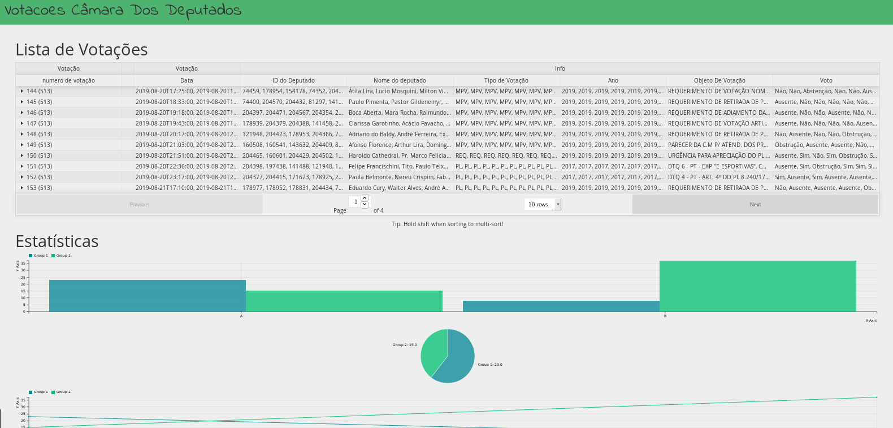

# Test Senado / Camara dos Deputados

### Setup:
> requires python 3.7 and node

clone the repository

```git clone https://github.com/fernand0aguilar/web-scrapping.git```

after the download

cd backend/

### RUN the backend
```
$ pip3 install -r requirements
$ python3 manage.py makemigrations
$ python3 manage.py migrate
$ python3 manage.py runserver
```
the backend should be running at localhost:8000

### RUN the frontend

open another terminal instance

cd frontend/

```
$ yarn install
$ yarn start
```
the frontend should be running at localhost:3000

***
## Test it
```
 python3 manage.py test
 open localhost:3000 at the browser
```

***

## PrintScreen

